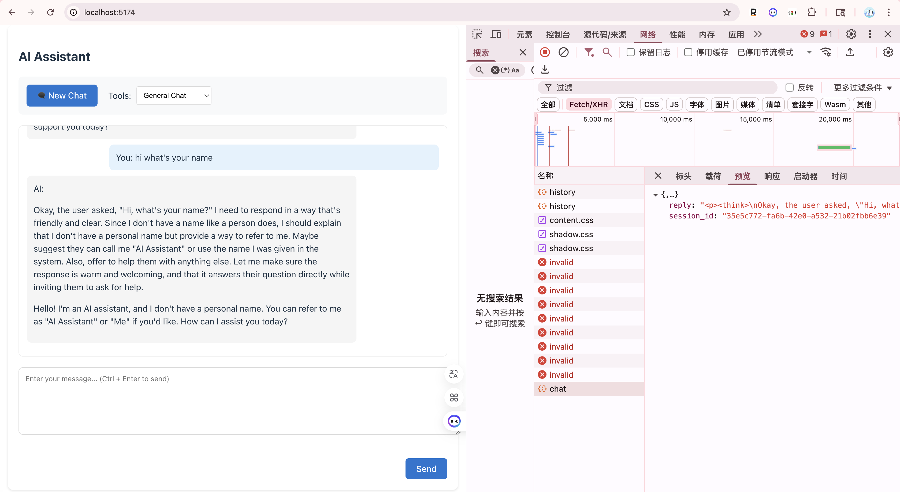

# AI Assistant

An AI assistant based on React 19 + Flask + HuggingFace API, supporting multiple tool functions.



## Project Structure

```
ai-assistant/
├── frontend/          # React frontend project
│   ├── src/          # React source code
│   ├── package.json  # Frontend dependencies
│   └── vite.config.js# Vite configuration
├── app.py            # Flask backend service
├── requirements.txt   # Python dependencies
└── .env              # Environment variables
```

## 环境准备

1. Python 环境 (3.x)
2. Node.js 环境 (18+)
3. HuggingFace API Key

## 启动步骤

1. 配置环境变量：
   创建 .env 文件并添加 HuggingFace API Key

   ```env
   HF_API_KEY=your_HF_API_KEY   # 替换为你的 HuggingFace API Key
   ```

2. 安装后端依赖：
   在项目根目录下

   ```bash
   pip install -r requirements.txt
   ```

3. 安装前端依赖：

   ```bash
   cd frontend
   pnpm install
   ```

4. 启动服务：

   ```bash
   # 终端 1：启动后端服务（在项目根目录）
   python app.py

   # 终端 2：启动前端服务（在 frontend 目录）
   cd frontend
   npm run dev
   ```

5. 访问应用：
   - 打开浏览器访问 http://localhost:5173

## API Key 获取

1. 获取 HuggingFace API Key：

   - 访问 https://huggingface.co/
   - 注册/登录账号
   - 进入 Settings -> Access Tokens
   - 点击 "New token" 创建新的 API token
   - 复制生成的 token

2. API Key 使用说明：

   - 有效期：API Key 默认永久有效，除非你手动删除或更新
   - 额度查看：
     1. 访问 https://huggingface.co/settings/billing
     2. 在 "Usage" 标签页可以查看 API 调用次数和费用
     3. 免费账户每月有一定的免费额度
     4. Pro 账户可获得更高的额度和优先访问权限

注意：

- 请妥善保管你的 API Key，不要分享给他人
- 如果发现 API Key 泄露，建议立即在 Settings -> Access Tokens 中删除并重新创建
- 建议定期检查使用量，避免超出预期
